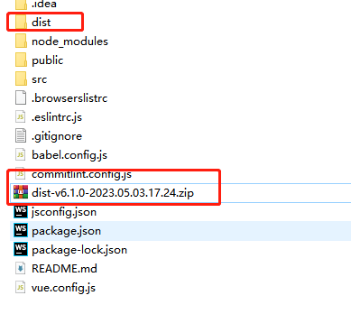

# mytemplate
模板整理保存

# 分支 utils
保存一些前端工具类

# npm 库

### 使用filemanager-webpack-plugin2.0.5版本vue2打包dist包之后生成zip压缩包
- https://www.npmjs.com/package/vue2-dist-zip
下载
> npm install filemanager-vue2-dist-zip -D 
> 
> 在vue.config.js中

> const zipPlugin = require('vue2-dist-zip')

> configureWebpack: {plugins: process.env.NODE_ENV === 'production' ? [zipPlugin('cppcc-data-exchange-shanxi')] : []}

